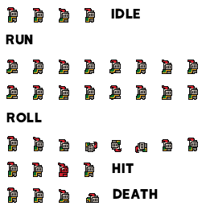

 

# First Game | Project Touchstone #
[How to make a Video Game - Godot Beginner Tutorial](https://www.youtube.com/watch?v=LOhfqjmasi0&t=443s) by [Brackeys](https://www.youtube.com/brackeys) ([Discord](https://discord.gg/brackeys))

This video tutorial provides a structured, beginner-friendly walkthrough of building a simple 2D platformer in the Godot Engine, guiding viewers through the core systems required to develop a functional player controller. It introduces and applies key concepts such as node-based scene organization, collision setup, input mapping, gravity-based physics, and animation handling, while demonstrating player movement using keyboard input and essential gameplay elements like collectible coins, enemy behavior, and environmental interactions. The tutorial also explores reusable scene structuring, accurate collision configuration, and system implementation through signals and scripted logic for features such as coin collection and enemy patrols. It also served as the foundation for completing a structured implementation task on Feather, with the project integrated into the wider development workflow supporting the Handshake AI Project Touchstone initiative.

# Assets #
[Brackeys' Platformer Bundle](https://brackeysgames.itch.io/brackeys-platformer-bundle) by [Brackeys](https://brackeysgames.itch.io/) ([PayPal](https://www.paypal.com/donate/?hosted_button_id=VCMM2PLRRX8GU))

# Create a Godot task #
<ins> What application is this task for? </ins>
 
Godot

### **Task prompt** ###
First, enter the **task prompt** and any relevant reference files (e.g., docs, diagrams, sketches, photos, schematics).

Tasks should sound like what a manager might give a skilled but junior employee: high-level guidance with some leeway on executional details, but with very clear success metrics. What a good outcome looks like must be very clear and easy to understand.

Include any relevant **reference files** (docs, diagrams, sketches, photos, schematics, etc) needed for someone to complete this task.

Reminder on the difference between reference and starting state files:
- **Reference files**: anything the Employee should look at or read while completing the project that does not need to be directly loaded into the application (*'please make something that looks like XYZ image'*)
- **Starting state files (upload below)**: anything that the Employee would need to load into their workspace to complete the task (*'here is the existing file you should adapt'*)

<ins> Task prompt (ask the Employee) </ins>
 
We are beginning development of the player controller for a new 2D pixel-art platformer game that will include new background music and sound effects to bring the game to life. Your task is to design and implement a functional player movement system using a pixelated sprite of a small armored knight featuring a red plume and a green cape, establishing the core mechanics and a responsive gameplay foundation. The movement system should prioritize smooth, precise, and consistent control by incorporating well-structured keyboard input handling, realistic physics behavior with gravity, and a responsive camera system that follows the player throughout gameplay. Vertical movement should respond naturally to gravity, creating steady downward acceleration, with the character consistently orienting toward the direction of movement while maintaining smooth, uninterrupted animations throughout all actions. All visual assets, including the player sprite, level background, environment props, and UI elements, should render sharply and clearly without distortion, preserving the visual clarity expected in a pixel-art environment. The level background must display a white sky with layered blue sections beneath it, maintaining a clean and readable visual composition. You will set up the necessary nodes, apply the pixelated character sprite, and configure collision and physics properties to ensure proper interaction with the environment. The completed movement system must support the following behaviors:

- Horizontal movement allows the player character to walk left.
- Horizontal movement allows the player character to walk right.
- The player character stops immediately when receiving no input.
- A standard jump allows the player character to propel upward.
- A moving platform travels back and forth across a gap for traversal.
- Collectible gold coins increase the coin counter when picked up.
- A green slime enemy patrols and damages the player on contact.
- The game resets when the player enters a killzone or takes damage.
- Clear label text elements provide instructions throughout the level.
- A coin counter UI displays the total coins collected in real time.
- Background music starts on game launch and loops continuously.

The environment must include platforms and terrain suitable for testing movement, along with a clearly defined structure for jumping and traversal. The environment should include a green moving platform that travels back and forth across a gap to allow traversal, and a green slime enemy that patrols the level and damages the player on contact. The level should feature collectible yellow coins that increase a displayed coin counter upon pickup, with each collection triggering an audio feedback sound effect. The level must also include a killzone that resets the game when the player falls below the level or takes damage from any enemy, restoring the game to the beginning. On-screen label text elements should guide the player through gameplay and controls, while background music starts at the beginning of the game and loops continuously throughout the experience. Overall behavior should demonstrate tight responsiveness, smooth transitions between actions, and a level of polish that supports further development and improvement for advanced platforming mechanics.

<ins> Which of the following best fits this task? </ins>
 
Task from scratch

<ins> How long would you anticipate an 'Employee' to complete this task? (in hours) </ins>
 
4

### **Starting state** ###
Please describe and include below any information about the starting state of this project:
- Existing work to be modified
- Other assets or other inputs the Employee needs to bring to be able to complete this task

Reminder on the difference between the starting state and the reference files:
- **Starting state files**: anything that the Employee would need to load into their workspace to complete the task ('*here is the existing file you should adapt*')
- **Reference files (upload above)**: anything the Employee should look at or read while completing the project that does not need to be directly loaded into the application ('*please make something that looks like XYZ image*')

<ins> Starting state description </ins>
 
The starting state for this task consists of a newly created 2D Godot project that includes a curated set of pixel-art platformer assets, forming the foundation for a fully playable platforming game. The project contains sprite sheets for a player character, multiple enemy types, collectible items, and environment tilesets for constructing levels and platforms. To enhance the atmosphere, the assets include a variety of sound effects for actions, background tracks, and pixel-style fonts specifically designed for platformer UI elements. The Employee is responsible for building the platformer game using the provided assets by setting up player and enemy scenes with appropriate nodes, collision shapes, and animations. The Employee must implement player movement mechanics, enemy behaviors, item collection systems, and interactions with platforms and environment tiles. This task includes defining input actions, attaching scripts to control gameplay behavior, configuring physics for gravity and collisions, and integrating audio feedback for player actions and events. The Employee must also construct level layouts using the provided tileset, ensuring smooth navigation and consistent platforming interactions. The reference materials demonstrate how to use the included assets to create a cohesive gameplay experience that supports responsive controls, clear visual feedback, and a complete platforming game.

### **Overall context** ###
Finally, include context on this task and why it is realistic and representative of real-life work:
- Why is this a reasonable task for a manager to ask a junior-level employee to do?
- Is there a larger project it might be a part of?

<ins> Task context </ins>
 
This task is a realistic and representative assignment for a junior-level developer, as it involves implementing core 2D platforming mechanics within a structured, asset-driven game environment, including player movement, jumping physics, enemy behavior, item collection, collision handling, and tile-based level construction. It requires applying foundational programming, problem-solving, and creative design skills to translate clear gameplay requirements into functional systems while integrating physics, animation, audio feedback, and user input into a cohesive experience. This project also reflects typical real-world development workflows, where developers build on an existing project structure, organize assets and scenes, and implement features in a modular and extensible way. As part of a larger game project, this task defines the core gameplay loop for a 2D platformer, providing a scalable foundation for future features, including additional levels, enemy types, power-ups, UI elements, and enhanced interactions. The effective integration of diverse assets, including sprites, animations, sound effects, and tilesets, is essential for creating an engaging game world that feels alive and supports ongoing development refinement.

<ins> Rubric Items </ins>
 
1. The characters, level background, and level props all appear sharp.
- Run the main scene and observe that all character sprites, level background, and environment props appear sharp and clear.
- The task prompt requires that all character sprites, level background, and level props remain visually sharp and clear.

2. The player character is a little knight with a red plume and green cape.
- Run the main scene and observe that the player character appears as a small armored knight with a red plume and green cape.
- The task prompt requires the player character to visually appear as a small armored knight with a red plume and green cape.

3. The level background is a white sky with lower-layered blue sections.
- Run the main scene and observe that the level background displays a white sky with multiple-layered blue sections.
- The task prompt requires that the level background display as a white sky with lower-layered blue sections.

4. The animations play smoothly and always face the correct direction.
- Run the main scene and move the player character to observe smooth animation transitions and the correct facing direction.
- The prompt requires that all character sprite animations play smoothly while facing the correct direction of movement.

5. The gravity physics produces a natural and consistent downward pull.
- Run the main scene and observe the player character falling to confirm that gravity causes a natural downward acceleration.
- The prompt requires that the environment's gravity produce realistic falling behavior and a consistent downward pull for entities.

6. The sprites properly collide with the environment, objects, and walls.
- Run the main scene and move the player character across the level to confirm it collides with all level and environmental objects.
- The task prompt requires functional collision bodies for the player character to interact correctly with all level environment elements.

7. The camera follows the player character smoothly during gameplay.
- Run the main scene and move the player character across the level to confirm that the game camera accurately tracks the player.
- The prompt requires smooth camera tracking to maintain a stable and consistent view of the player character throughout gameplay.

8. The sprite moves with the arrow keys and stops when input is released.
- Run the scene, move the player character with the left and right arrow keys, then release the keys to confirm it stops immediately.
- The prompt requires the arrow keys for horizontal movement, and the player character must immediately stop when releasing input.

9. The player character can jump upward when pressing the Space key.
- Run the main scene, then press the Space key to observe the player character perform an upward jump within the environment.
- The task prompt requires that pressing the Space key triggers the player character to perform an upward jump with an animation.

10. The player character can collect gold coins and play a sound effect.
- Run the main scene and collect coins to observe that a sound effect plays each time the player collects a gold coin throughout the level.
- The task prompt requires that gold coins trigger an audio feedback sound when the player character collects gold coins.

11. A platform moves back and forth for the player to travel over a gap.
- Run the main scene and observe a green platform moving back and forth, allowing the player character to travel across a gap.
- The task prompt requires a moving platform mechanic that allows the player character to cross a gap in the level.

12. The game resets when the player falls in the killzone or takes damage.
- Run the main scene, make the player character fall below the level or get hit by an enemy to confirm the game resets properly.
- The task prompt requires the game to restart when the player character falls into the killzone or takes damage from an enemy.

13. A green slime enemy moves back and forth to try to hurt the player.
- Run the main scene and observe that the green slime enemy patrols back and forth, attempting to damage the player character.
- The task prompt requires an enemy that moves in a pattern and interacts with the player character by dealing damage.

14. A coin counter at the end of the level counts the coins collected.
- Run the main scene, collect the coins, and reach the end to confirm that the counter displays the total number of coins collected.
- The task prompt requires a visible coin counter that updates and displays the total number of coins the player has collected.

15. Label text elements guide the player character throughout the level.
- Run the main scene and observe the various label texts that provide instructions or guidance throughout the level.
- The task prompt requires on-screen text elements that guide the player character throughout the level.

16. There is background music that plays and loops when the game starts.
- Run the main scene and observe that the background music begins playing and loops at the end of the music audio.
- The task prompt requires implementing looping background music that automatically starts when the game begins.
 
Godot - Full Vertical Slice (Game Prototype) - Finished prompt creation.
